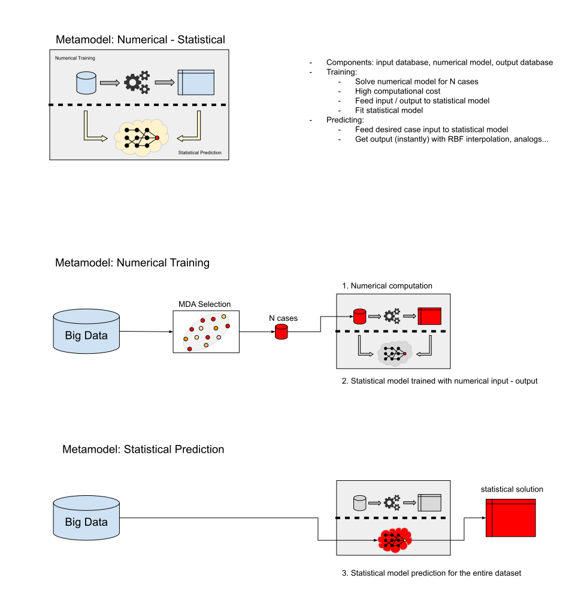
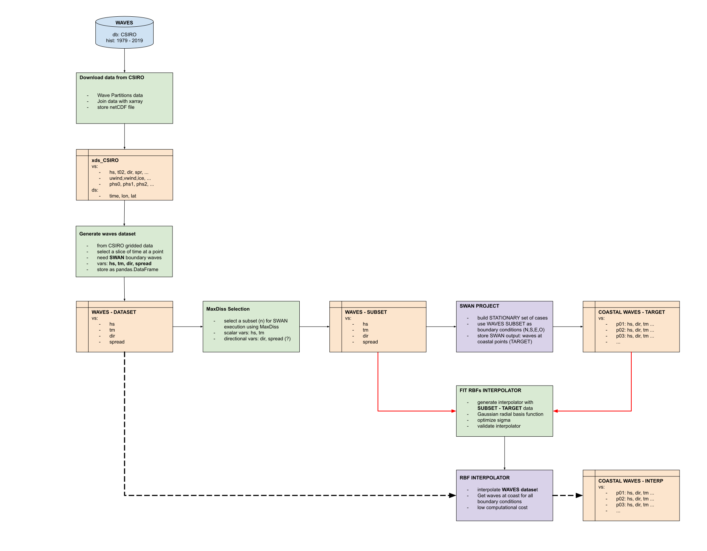

# HyWaves

A hybrid metamodel (numerical-statistical) approach to optimize complex waves calculations.

## Table of contents
1. [Description](#desc)
2. [Main Contents](#mc)
3. [Documentation](#doc)
4. [Schemes](#sch)
5. [Install](#ins)
    1. [Install from sources](#ins_src)
    2. [Install SWAN numerical model](#ins_swn)
    3. [Install SWASH numerical model](#ins_swh)
6. [Examples](#exp)
    1. [SWAN numerical wrap](#exp_1)
    2. [HySWAN metamodel](#exp_2)
    3. [SWASH numerical wrap](#exp_3)
    4. [HySWASH metamodel](#exp_4)
7. [Contributors](#ctr)
8. [License](#lic)


<a name="desc"></a>
## Description

Solving open source waves numerical models executions could require considerable computational resources and time.
This could be a problem when trying to solve a big dataset of numerical cases.

This toolbox includes a hybrid (metamodel) methodology to optimize this process:

- Using MaxDiss classification a small but representative subset of the input dataset is selected.
- Numerical cases are solved with the customized python wrappers given with the source code.
- a Radial Basis Function interpolator is feed with the selected subset and its corresponding Numerical cases output.
- Now this Radial Basis function interpolator can be used to solve the entire dataset with almost no computer resources.
 

<a name="mc"></a>
## Main contents

Numerical models

[swan](./hyswan/swan/): SWAN numerical model toolbox 
- [io](./hyswan/swan/io.py): SWAN numerical model input/output operations
- [wrap](./hyswan/swan/wrap.py): SWAN numerical model python wrap 
- [geo](./hyswan/swan/geo.py): azimuth distance function
- [storms](./hyswan/swan/storms.py): storm parameters function 
- [plots](./hyswan/swan/plots/): plotting module 

[swash](./hyswan/swash/): SWASH numerical model toolbox 
- [io](./hyswan/swan/io.py): SWASH numerical model input/output operations
- [wrap](./hyswan/swan/wrap.py): SWASH numerical model python wrap 
- [plots](./hyswan/swan/plots/): plotting module 

Statistical modules 

- [mda](./hyswan/mda.py): MaxDiss classification module 
- [rbf](./hyswan/rbf.py): Radial Basis Function module


<a name="doc"></a>
## Documentation

Camus et al. (2011). A hybrid efficient method to downscale wave climate to coastal areas. Coastal Engineering 58 (2011), 851-862. <http://doi.org/10.1016/j.coastaleng.2011.05.007>

SWAN numerical model detailed documentation can be found at: <http://swanmodel.sourceforge.net/> 

- [SWAN install/compile manual](http://swanmodel.sourceforge.net/download/download.htm)
- [SWAN user manual](http://swanmodel.sourceforge.net/online_doc/swanuse/)

SWASH numerical model detailed documentation can be found at: <http://swash.sourceforge.net/>

- [SWASH install/compile manual](http://swash.sourceforge.net/download/download.htm)
- [SWASH user manual](http://swash.sourceforge.net/online_doc/swashuse/swashuse.html)

<a name="sch"></a>
## Schemes

Statistical Metamodel


HyWaves - SWAN STATIONARY Methodology



<a name="ins"></a>
## Install
- - -

Source code is currently privately hosted on GitLab at:  <https://gitlab.com/geocean/bluemath/hywaves/tree/master> 


<a name="ins_src"></a>
### Install from sources

Install requirements. Navigate to the base root of [hywaves](./) and execute:

```bash
   # Default install, miss some dependencies and functionality
   pip install -r requirements/requirements.txt
```

Then install hywaves:

```bash
   python setup.py install

```

<a name="ins_swn"></a>
### Install SWAN numerical model 

Download and Compile SWAN numerical model:

```bash
  # you may need to install a fortran compiler
  sudo apt install gfortran

  # download and unpack
  wget http://swanmodel.sourceforge.net/download/zip/swan4131.tar.gz
  tar -zxvf swan4131.tar.gz

  # compile numerical model
  cd swan4131/
  make config
  make ser
```

Copy SWAN binary file to module resources

```bash
  # Launch a python interpreter
  $ python

  Python 3.6.9 (default, Apr 18 2020, 01:56:04) 
  [GCC 8.4.0] on linux
  Type "help", "copyright", "credits" or "license" for more information.
  
  >>> from hywaves import swan
  >>> swan.set_swan_binary_file('swan.exe')
```

<a name="ins_swh"></a>
### Install SWASH numerical model 

Download and Compile SWASH numerical model:

```bash
  # you may need to install a fortran compiler
  sudo apt install gfortran

  # download and unpack
  wget http://swash.sourceforge.net/download/zip/swash-6.01.tar.gz
  tar -zxvf swash-6.01.tar.gz

  # compile numerical model
  cd swash-6.01/
  make config
  make ser
```

Copy SWASH binary file to module resources

```bash
  # Launch a python interpreter
  $ python

  Python 3.6.9 (default, Apr 18 2020, 01:56:04) 
  [GCC 8.4.0] on linux
  Type "help", "copyright", "credits" or "license" for more information.
  
  >>> from hywaves import swash
  >>> swash.set_swash_binary_file('swash.exe')
```


<a name="exp"></a>
## Examples:
- - -

<a name="exp_1"></a>
### SWAN numerical wrap 

- [demo 01 - STATIONARY](./scripts/hyswan/demo_01_stat.py): stationary example
- [demo 02 - NON-STATIONARY](./scripts/hyswan/demo_02_nonstat.py): non-stationary example 
- [demo 03 - VORTEX](./scripts/hyswan/demo_03_nonstat_vortex.py): non-stationary with TCs Vortex Model example 

<a name="exp_2"></a>
### HySWAN: MDA -> SWAN -> RBF metamodel 

- [notebook - HySWAN Metamodel](./notebooks/hyswan/MDA_SWAN_RBF.ipynb): HySWAN example: simplified metamodel waves propagation

<a name="exp_3"></a>
### SWASH numerical wrap 

- [notebook - SWASH Case](./hyswash/Swash_case.ipynb): An easy-to-use Jupyter Notebook to model wave transformation over a shallow cross-shore profile

<a name="exp_4"></a>
### HySWASH: MDA -> SWASH - RBF metamodel


<a name="ctr"></a>
## Contributors:

Nicolas Ripoll Cabarga (ripolln@unican.es)\
Alba Ricondo Cueva (ricondoa@unican.es)\
Sara Ortega Van Vloten (sara.ortegav@unican.es)\
Fernando Mendez Incera (fernando.mendez@unican.es)


<a name="lic"></a>
## License

This project is licensed under the MIT License - see the [license](./LICENSE.txt) file for details

